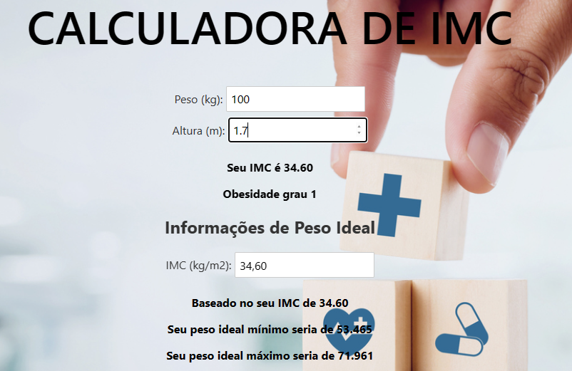

# Desafio 3

## 1 - Calculando o IMC e mostrando a sua classificação

1.1 - Criou-se a função function calcularIMC() que calculará o IMC do usuário, passando peso
e altura como entradas

```bash
    function calcularIMC(peso, altura){
		return (peso / Math.pow(altura, 2)).toFixed(2);
	}
```

1.2 - Foi criada uma função 'exibirClassificacaoIMC(imc)' que irá analisar o IMC do usuário
e mostrar qual a classificação(abaixo do peso, obesidade grau 1...)

```bash
    function exibirClassificacaoIMC(imc) {
		if (imc <= 18.5) {
			return 'Abaixo do peso';
		} else if (imc <= 24.9) {
			return 'Peso ideal (Parabéns!)';
		} else if (imc <= 29.9) {
			return 'Levemente acima do peso';
		} else if (imc <= 34.9) {
			return 'Obesidade grau 1';
		} else if (imc <= 39.9) {
			return 'Obesidade grau 2 (severa)';
		} else {
			return 'Obesidade grau 3 (mórbida)';
		}
	}
```

1.3 - Usou-se a função atualizarIMC() que irá retornar o resultado de ambas as funções

```bash
    function atualizarIMC() {
        imc = calcularIMC(peso, altura);
        classificacao = exibirClassificacaoIMC(imc);
    }
```

## 2 - Implementandos funcionalidades

2.1 - Calcular o peso máximo e mínimo do usuário

```bash
    function pesoIdeal(){
		peso_ideal_mínimo = 18.5 * (Math.pow(altura, 2)).toFixed(2);	
		peso_ideal_máximo = 24.9 * (Math.pow(altura, 2)).toFixed(2);	
	}
```

2.2 - Mostrar dicas ao usuário baseado no seu IMC

2.2.1 - Criou-se um array: let dicasArray = []; que armazenará as possibilidades

2.2.2 - Foram feitas várias funções, baseadas na classificação do IMC, que retornarão
um array que contém dicas para uma vida mais saudável

```bash
function abaixoPeso(){
    return [
        'Vá a um nutricionista. Para melhorar a sua alimentação.',
        'Comece a fazer atividades físicas.',
        'Faça uma caminhada para ganhar condicionamento físico.',
        'Dica extra: Vá a um endocrinologista para verificar se não há disfunção hormonal.'
    ];
	}

	function pesoideal(){
    	return ['Continue sendo esta pessoa saudável!'];
	}

	function levementeAcimaPeso(){
    	return [
        	'Comece a se alimentar melhor.',
        	'Caso você não faça atividades físicas, comece a fazer.',
        	'Assim, você logo estará na sua melhor forma.'
    	];
	}

	function obesidadeGrau1(){
		return [
			'Cuidado! Procure um nutricionista!',
			'Procure também um cardiologista para examinar seu coração.',
			'Comece a fazer exercícios como caminhada e pilates para ganhar ritmo de treino.',
			'Tente manter esta rotina saudável.'
		];
	}

	function obesidadeGrau2(){
		return [
			'Cuidado! Procure um cardiologista!',
			'Veja se o seu coração está muito prejudicado.',
			'Comece a fazer exercícios leves como caminhada e esteira para ganhar ritmo de treino.',
			'Procure um nutricionista.',
			'Consuma verduras, frutas e grãos.',
			'Tente manter esta rotina saudável.'
		];
	}

	function obesidadeGrau3(){
		return [
			'ATENÇÃO! VOCÊ CORRE RISCO DE VIDA!',
			'Procure um cardiologista!',
			'Veja se o seu coração está muito prejudicado.',
			'Comece a fazer exercícios leves como caminhada e esteira para ganhar ritmo de treino.',
			'Procure um nutricionista.',
			'Consuma verduras, frutas e grãos.',
			'Evite comidas gordurosas para não correr mais risco de vida.',
			'Tenha uma rotina saudável.',
			'Procure um ortopedista para verificar seus joelhos.'
		];
	}
```

2.2.3 - Usou-se a função dicas para analisar qual função retornará 

```bash
function dicas(imc){
		dicasArray = [];
		imc = parseFloat(imc);
		if (imc <= 18.5) {
			return abaixoPeso();
		} else if (imc <= 24.9) {
			return pesoideal();
		} else if (imc <= 29.9) {
			return levementeAcimaPeso();
		} else if (imc <= 34.9) {
			return obesidadeGrau1();
		} else if (imc <= 39.9) {
			return obesidadeGrau2();
		} else {
			return obesidadeGrau3();
		}
	}
```

2.2.4 - A função atualizarDicas() tranforma o IMC em um número e insere na função 
atualizarDicasArray() que irá inserir no Array de dicasArray que foi inicializado na função dicas()

```bash
	function atualizarDicas() {
    	let imcNumber = Number(imc); // Convertendo para número
    	atualizarDicasArray(imcNumber);
	}

	function atualizarDicasArray(imcNumber) {
    	dicasArray = dicas(imcNumber);
	}
```

2.2.5 - Percorrendo esse array dicasArray e obtendo o resultado

```bash
<h3>Dicas para ter uma vida mais saudável</h3>
  	<label>
    	IMC (kg/m2): <input type="number" bind:value={imc} on:input={atualizarDicas}/>
  	</label>

  	{#if dicasArray.length > 0}
    	<ul class="dark-text">
      	{#each dicasArray as dica}
        	<li>{dica}</li>
      	{/each}
    	</ul>
 	{/if}
```

## 3 - Trabalhando o Front-end

3.1 - Inseriu-se uma imagem de fundo

```bash
    background-image: url('https://mv.com.br/storage/blog/1541342023072564c0175e07e30.jpeg'); 
    background-size: cover; 
```

3.2 - Modificou-se os caracteres em termos de tamanho e cor

```bash
    h1 {
		color: #000000;
		text-transform: uppercase;
		font-size: 4em;
		font-weight: 500;
	}


    .dark-text {
        color: #000000; /* Cor do texto mais escura */
		font-weight: 700;
    }
```
    
# 4 - Resultado final

4.1 - Página Inicial


4.2 - Inserindo as informações de peso e altura



4.3 - Mostrando as dicas de uma saúde melhor


