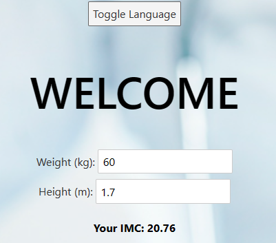
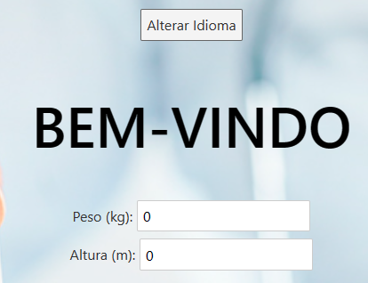

# Desafio 4

## 1 - Traduzindo do português para inglês ou vice-versa

1.1 - Importou-se a dependência que fará a tradução

```bash
    "svelte-i18n": "^3.7.4"
```

1.2 - No package.json fica da seguinte forma

```bash
    "dependencies": {
    "@fortawesome/fontawesome-free": "^6.4.2",
    "sirv-cli": "^2.0.0",
    "svelte-i18n": "^3.7.4"
   }
```

1.3 - Importou-se "onMount" que executa uma verificação inicial do idioma e que carrega as configurações do usuário.

```bash
    import { onMount } from 'svelte';
```

## 2 - Implementando um botão para a tradução

2.1 - A função toggleLanguage() é chamada (com o clique do botão), ela alternará entre os idiomas 'pt' e 'en' e atualizará o idioma na variável currentLanguage. Além disso, ela usa o localStorage para armazenar o idioma selecionado, garantindo que a escolha do idioma seja mantida entre as sessões do usuário.

```bash
    function toggleLanguage() {
    currentLanguage = currentLanguage === 'pt' ? 'en' : 'pt';
    localStorage.setItem('language', currentLanguage);
  }
```

2.2 - Arquivo de chave e valor usado para a tradução(let translations) que contém as traduções para diferentes idiomas. Há dois idiomas definidos: 'pt' para português e 'en' para inglês. Cada idioma é representado por um objeto que mapeia chaves (como 'welcome', 'weight', etc.) para as traduções correspondentes.

```bash
let translations = {
    pt: {
      welcome: 'Bem-vindo',
      weight: 'Peso',
      height: 'Altura',
      yourIMC: 'Seu IMC',
      classificacao: 'Classificação',
      infoWeight: 'Informação de Peso',
      basedOnYourIMC: 'Baseado no seu IMC',
      yourMinIdealWeight: 'Seu peso mínimo ideal',
      yourMaxIdealWeight: 'Seu peso máximo ideal',
      toggleLanguage: 'Alterar Idioma',
    },
    en: {
      welcome: 'Welcome',
      weight: 'Weight',
      height: 'Height',
      yourIMC: 'Your IMC',
      classificacao: 'Classification',
      infoWeight: 'Weight Information',
      basedOnYourIMC: 'Based on your IMC',
      yourMinIdealWeight: 'Your minimum ideal weight',
      yourMaxIdealWeight: 'Your maximum ideal weight',
      toggleLanguage: 'Toggle Language',
    },
  };
```

## 3 - Resultado Final

3.1 - Inglês



3.2 - Português

